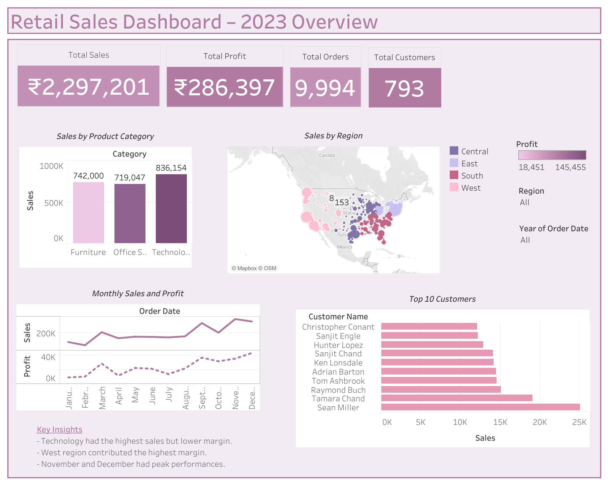

# 🛍️ Retail Sales Analytics (2023) – EDA + Tableau Dashboard

This project showcases an end-to-end data analytics pipeline:
- 📥 Data Cleaning with Python
- 🔍 Exploratory Data Analysis (EDA)
- 📊 Interactive Dashboard using Tableau

---

## 📂 Project Breakdown

### 1. Data Cleaning & EDA (Python)
- Removed missing values, duplicates
- Standardized column formats
- Performed EDA on sales, profit, customers, region
- Visualized using Seaborn and Matplotlib

📄 Notebook: `Retail_Sales_Analytics_EDA.ipynb`

---

### 2. Interactive Dashboard (Tableau)
- Total Sales, Profit, Orders, and Customers
- Sales by Category, Region, and Customer
- Monthly sales & profit trends
- Filters by Year and Region
- Key insights generated with GenAI

📊 Tableau File: `Retail Sales Dashboard - 2023.twbx`  
📸 Preview:  

---

## 🧠 Key Insights
- Technology segment had highest sales but low profit margin.
- West region contributed the highest overall profit.
- November and December were peak performing months.

---

## 🛠️ Tools & Tech
- Python (Pandas, NumPy, Matplotlib, Seaborn)
- Tableau Public
- ChatGPT (for summarization & insight extraction)

---

## 📌 Outcome
This project demonstrates an end-to-end business data analysis pipeline — useful for dashboards, business intelligence, and stakeholder storytelling.

---

👤 **Author**: Madhu Sudhan  
📫 [LinkedIn](https://www.linkedin.com/in/uday-meka/)
